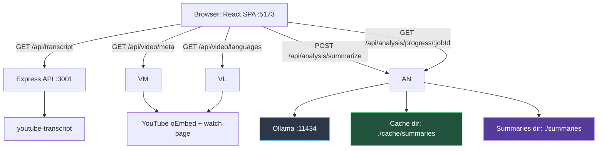
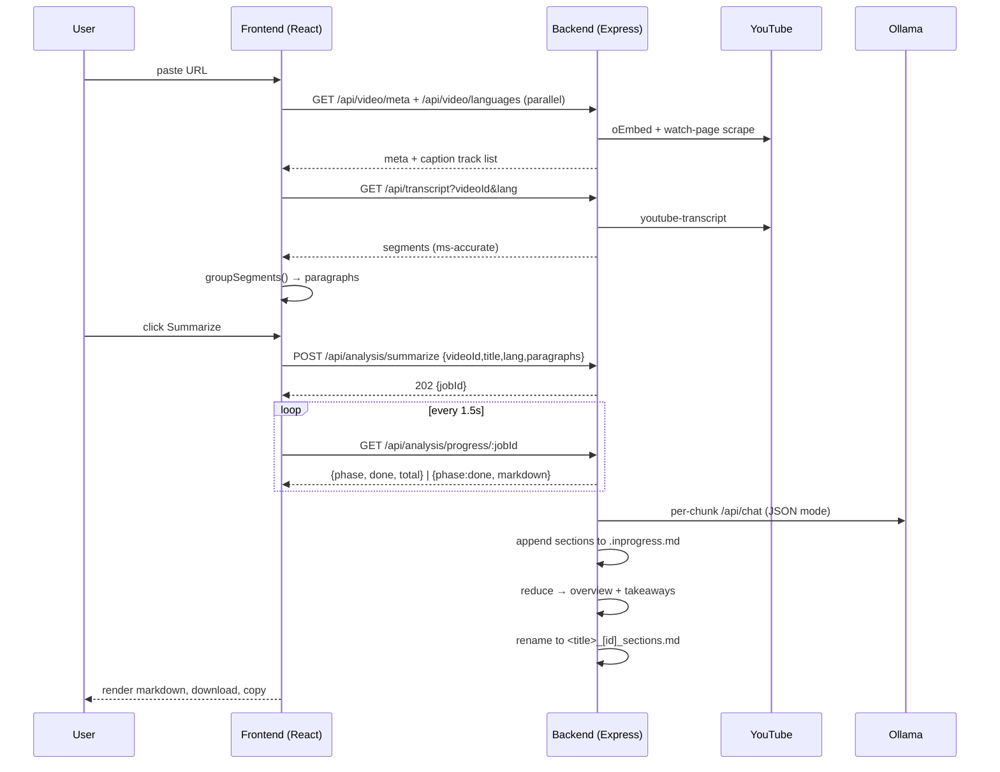
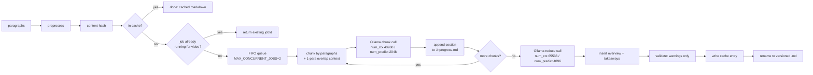
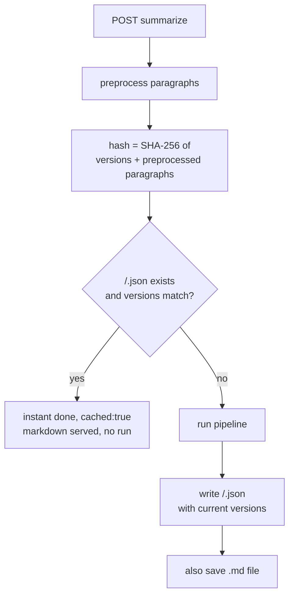
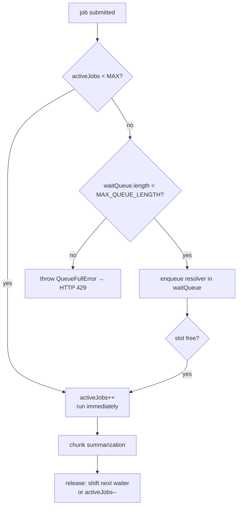
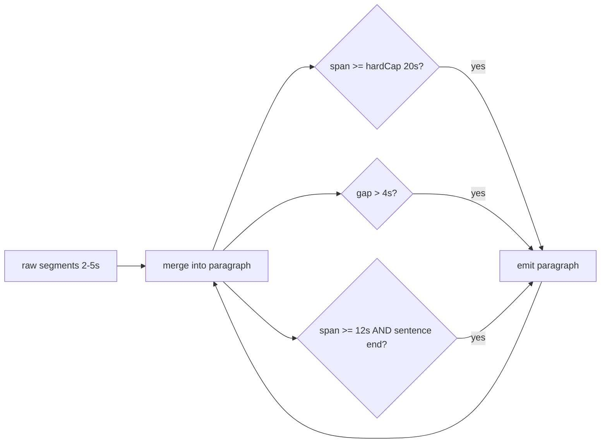
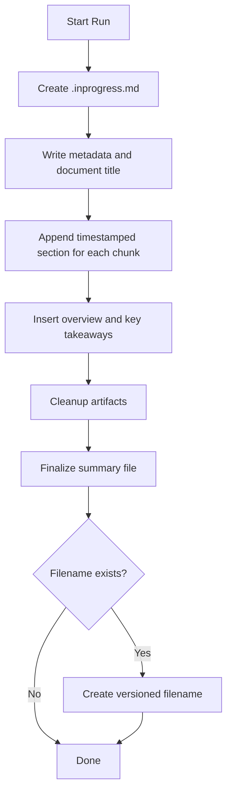
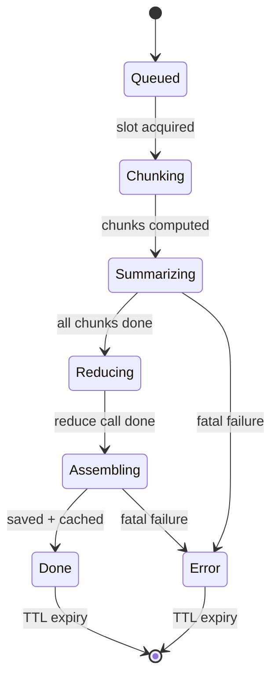

# YT Transcript

A full-featured YouTube transcript viewer with a **local, private AI summarizer**. Paste any YouTube link, get the complete caption track as a clean, searchable, exportable document in seconds — then generate timestamped, sectioned study notes with your own local Ollama model. Nothing ever leaves your machine.

> **Current status:** Phase 1.2 — AI summarization (local Ollama) is **done and verified**. The transcript viewer (Phase 1.1) and the summarization pipeline (Phase 1.2) are complete. Later phases (summary styles, model selection, Whisper fallback, persistence) are planned — see [Roadmap](#20-roadmap).

<!--
Screenshot placeholder — add a real capture here before publishing:

Alt text: YT Transcript with a video metadata card, grouped paragraphs, and an AI summary panel.
-->

---

## Table of Contents

1. [Overview](#1-overview)
2. [Features](#2-features)
3. [Architecture](#3-architecture)
4. [Project Structure](#4-project-structure)
5. [Workflow](#5-workflow)
6. [Summarization Pipeline](#6-summarization-pipeline)
7. [API Documentation](#7-api-documentation)
8. [Frontend](#8-frontend)
9. [Backend](#9-backend)
10. [AI Integration](#10-ai-integration)
11. [Performance](#11-performance)
12. [Error Handling](#12-error-handling)
13. [Configuration](#13-configuration)
14. [Installation](#14-installation)
15. [Usage](#15-usage)
16. [Example Output](#16-example-output)
17. [Engineering Decisions](#17-engineering-decisions)
18. [Testing](#18-testing)
19. [Limitations](#19-limitations)
20. [Roadmap](#20-roadmap)
21. [Contributing](#21-contributing)
22. [License](#22-license)

---

## 1. Overview

### The problem

YouTube subtitles are captions, not documents. Raw caption tracks are a stream of 2–5 second fragments with no paragraph structure and no way to search, reuse, or study the content. Long-form content — lectures, podcasts, conference talks, streams — can have 20,000+ fragments. And once you have the text, understanding an hours-long video still means reading everything.

### What it solves

YT Transcript turns any YouTube video into a **readable, searchable, exportable document** and, with a local LLM, into **structured timestamped study notes**. It handles videos of any length, in every language the video offers captions for, and keeps the data completely local when AI is involved.

### Why local AI

Summarization runs through your own [Ollama](https://ollama.com) installation. Transcripts are private by nature — lecture notes, meetings, research talks — and sending them to a hosted API is not acceptable for many users. The backend talks to Ollama directly; the browser never does. When Ollama is unavailable, every non-AI feature (transcript, search, export) still works.

### Who it is for

- Students taking notes from lecture videos.
- Developers reading conference talks and technical deep-dives.
- Researchers and analysts processing long-form interviews or podcasts.
- Anyone who prefers reading a transcript over watching a video.

### Key goals

1. **Instant** — a 20,000-segment transcript renders and scrolls at 60 fps.
2. **Complete** — every caption track, every language, exportable in five formats.
3. **Private** — AI runs on your hardware; no data leaves the machine.
4. **Resilient** — long summarization runs survive chunk failures and process deaths.
5. **Deterministic** — fixed prompts, temperature 0, and content-addressed caching make results reproducible.

---

## 2. Features

### Transcript features

- **Paste any YouTube link** — full URLs, `youtu.be` short links, `shorts/`, `embed/`, `live/` URLs, and bare 11-character IDs are all recognized and normalized.
- **Full transcript, grouped into paragraphs** — raw 2–5s fragments are merged into readable paragraphs using sentence-boundary, time-window, and gap heuristics (see [Transcript processing](#6-summarization-pipeline)).
- **Multi-language captions** — every caption track a video offers (manual + auto-generated) is enumerated server-side and shown in a searchable language picker. English is selected by default when available; otherwise the first track loads and the UI explains why.
- **Caption quality badge** — Manual / Auto-generated / Unknown is surfaced so users can judge reliability.
- **Video metadata card** — title, channel, thumbnail, duration, publish date, and a link back to the video.
- **Live statistics** — word count, estimated read time, paragraph count, and transcript duration.

### Search

- **Full-text search across every paragraph**, not just what is on screen.
- **Prev/next match navigation** that scrolls the active match to center and highlights it.
- **Keyboard shortcuts** — `/` focuses search, `Enter` / `Shift+Enter` move forward/back, `Esc` clears.

### Export & sharing

- **Copy** with timestamps, without timestamps, or just the current text selection.
- **Download** in **TXT, Markdown, JSON, SRT, and WebVTT** — all timestamp-accurate in milliseconds (SRT/VTT are ready for video editors).
- **Sanitized filenames** — transcripts download as `<title>_[<videoId>].<ext>`.

### AI summarization (Phase 1.2)

- **Local and private** — runs through a local Ollama instance (`qwen3.5:4b`); the client never talks to Ollama directly.
- **Sectioned markdown notes** — the model writes `## [h:mm:ss]`-timestamped sections per transcript chunk, plus an overview and key takeaways, in a fixed server-owned scaffold.
- **One click from the transcript view** — a Summarize panel shows live stage progress (`Queued`, `Chunking…`, `Summarizing 7/10`, `Reducing…`, `Assembling…`) and collapses when done.
- **Timestamp jump** — clicking a section's timestamp button in the rendered summary scrolls the transcript to that exact point.
- **Copy & download** — finished notes copy to the clipboard or download as a `.md` file named after the video title.
- **Cache badge** — instantly-served repeat requests are labeled "Loaded from cache — no regeneration needed".
- **Resume after refresh** — the active job survives a page reload via `localStorage` (polling resumes when the same video and language are still selected).
- **Progressive writing** — the summary is appended chunk-by-chunk to a `.inprogress.md` file, so a long run stays salvageable even if a chunk fails or the process dies.
- **Automatic final file** — on completion the run is renamed to a versioned (`_v2`, `_v3`, …) markdown file that never overwrites an existing one.
- **Resilient** — a failed chunk is skipped with a visible marker and the run continues; a failed reduce pass simply omits the overview block.

### Performance

- **Virtualized rendering** — only visible rows (plus overscan) exist in the DOM, so hours-long transcripts stay instant.
- **Two layers of caching** — `Cache-Control` headers let the browser cache transcripts/meta/languages, and a persistent content-hash cache covers summaries.
- **Bounded concurrency** — a global FIFO queue gates Ollama to `MAX_CONCURRENT_JOBS` (default 2) so a burst of requests cannot saturate the CPU.
- **Memory-bounded pipeline** — only one chunk and one section summary are held in memory at a time; the file is appended, never buffered.

### Reliability

- **Race-safe request handling** — switching languages or videos mid-load never shows stale data (monotonic request IDs).
- **Per-video job deduplication** — starting the same video twice returns the same `jobId`; only one run happens.
- **Explicit error states** — invalid link, no captions, unavailable language, Ollama down, and queue-full all produce clear, actionable messages.
- **TTL-bounded job registry** — finished job entries expire after 30 minutes; files and cache entries persist.

### Developer features

- Strict TypeScript end-to-end, `tsx` for dev, Vite for the SPA.
- Oxlint with React rules.
- A single `run.bat` one-command launcher for Windows.

### UX

- Loading skeletons, toast notifications, keyboard-accessible controls.
- **Dark mode** and `prefers-reduced-motion` support.
- Dismissible notice when English captions are unavailable.

---

## 3. Architecture

### Overall architecture



The frontend talks only to `/api/*`. In development, Vite proxies these to the backend on `:3001`. The backend is the single owner of YouTube scraping, the AI pipeline, the queue, caching, and file generation.

### Frontend ↔ Backend data flow



### Summarization pipeline



### Caching flow



The cache is content-addressed: the same transcript through the same prompt/model/pipeline versions always resolves to the same key. Bumping any version constant invalidates the cache for all entries automatically.

### Queue flow



### Transcript processing (grouping)



### File generation



---

## 4. Project Structure

```
yt-analysis/
├── backend/                      # Express API — owns YouTube data + AI pipeline
│   └── src/
│       ├── index.ts              # App bootstrap: cors, 5mb JSON, /api/health, routers, 404
│       ├── types.ts              # Shared domain types + ApiError
│       ├── routes/
│       │   ├── transcript.ts     # GET /api/transcript
│       │   ├── video.ts          # GET /api/video/meta, /api/video/languages
│       │   └── analysis.ts       # POST /summarize, GET /progress/:jobId
│       └── services/
│           ├── youtube.ts        # ID/URL normalization, watch-page scraping, captions, oEmbed
│           └── ai/
│               ├── ollama.ts     # Native /api/chat wrapper (JSON mode, think:false, temp 0)
│               ├── summarize.ts  # Preprocessing, chunking, prompts, two-layer JSON parser,
│               │                 # queue/locks/jobs, content-hash cache, assembly, validation
│               └── saveSummary.ts# Filename sanitization, .inprogress creation, versioned finalize
├── frontend/                     # React SPA — viewer UI
│   └── src/
│       ├── main.tsx              # React root + ToastProvider
│       ├── App.tsx               # Top-level state machine (idle/loading/success/error)
│       ├── api/
│       │   ├── client.ts         # Fetch layer (browser caches via Cache-Control headers)
│       │   └── analysisClient.ts # /api/analysis client (start + poll)
│       ├── hooks/
│       │   ├── useTranscript.ts  # Race-safe transcript/language/meta state
│       │   ├── useSummarize.ts   # Poll loop, runId race-safety, localStorage resume
│       │   └── useClickOutside.ts# Shared dismiss-on-outside-click/Escape handler
│       ├── context/
│       │   └── ToastContext.tsx  # Toast notification provider
│       ├── components/
│       │   ├── analysis/SummarizePanel.tsx   # Summary trigger, progress, render, copy/download
│       │   ├── TranscriptView.tsx            # Toolbar, search, stats, wiring everything together
│       │   ├── VirtualTranscriptBody.tsx     # TanStack Virtual windowed list
│       │   ├── VideoMetaCard.tsx             # Thumbnail, title, channel, meta chips
│       │   ├── LanguageSelector.tsx          # Searchable caption-language picker
│       │   ├── SearchBar.tsx                 # Search box + match navigation
│       │   ├── HighlightText.tsx             # <mark> highlighting of matches
│       │   ├── QualityBadge.tsx              # Manual/Auto/Unknown badge
│       │   ├── DropdownMenu.tsx              # Accessible menu (copy/download)
│       │   ├── UrlInput.tsx                  # URL form + validation
│       │   ├── Skeleton.tsx                  # Loading shimmer
│       │   ├── Toasts.tsx                    # Toast list renderer
│       │   └── icons.tsx                     # Inline SVG icon set
│       └── utils/
│           ├── group.ts         # Segment → paragraph grouping heuristics
│           ├── export.ts        # TXT/MD/JSON/SRT/VTT formatters + filename sanitizers
│           ├── youtube.ts       # ID extraction, ms formatting, word-count estimates
│           └── language.ts      # Caption-kind labels
├── run.bat                      # One-command launcher (backend + frontend + browser)
└── SUMMARY.md                   # Short product summary
```

Why it is split this way:

- **`backend/` owns every external dependency** — YouTube scraping and Ollama. The SPA is a thin, fast client. This keeps the queue, the cache, and file generation in one process, and keeps the browser from ever holding long-lived work.
- **`services/ai/` is deliberately separated from `routes/`** — HTTP concerns (validation, status codes) never leak into the pipeline, and the pipeline stays independently testable.
- **Frontend hooks encapsulate all async state** — `useTranscript` and `useSummarize` own request-race and polling logic so components stay declarative.

---

## 5. Workflow

A complete user journey, step by step:

1. **User opens the app** — the SPA renders an input, ready at `http://localhost:5173`.
2. **User pastes a URL** — `UrlInput` validates it with `isValidYoutubeUrl` and normalizes it with `extractVideoId`.
3. **Fetch metadata** — `useTranscript.load` calls `GET /api/video/meta` and `GET /api/video/languages` in parallel. The backend hits the YouTube oEmbed endpoint and scrapes the watch page for `captionTracks`, `lengthSeconds`, and `uploadDate`. Both are cached in the browser (24h) via `Cache-Control`.
4. **Fetch the transcript** — the backend calls `youtube-transcript` with the default language (`en` if available, else the first track) and returns millisecond-accurate segments.
5. **Group the transcript** — the frontend runs `groupSegments`, merging fragments into readable paragraphs via sentence/time-window/gap heuristics.
6. **Display the transcript** — `TranscriptView` renders the metadata card, stats, the Summarize panel, and a virtualized list. Search highlights matches across the whole document.
7. **Start summarization** — the user clicks **Summarize**. `SummarizePanel` sends the already-grouped paragraphs to `POST /api/analysis/summarize`.
8. **Queue** — the backend preprocesses, hashes, checks the cache, deduplicates per video, and either runs immediately or enqueues behind the global FIFO gate (max 2 concurrent).
9. **Chunking** — paragraphs are split greedily into ~8000-character chunks with a one-paragraph overlap for context continuity.
10. **Ollama** — each chunk is sent to the local model with a strict JSON prompt (`think:false`, `format:"json"`, `temperature:0`). Output is run through the tolerant two-layer JSON parser.
11. **Reduce** — after all chunks, one call condenses the section summaries into an overview + key takeaways.
12. **Validation** — the assembled document is checked (section count, ordering, JSON leakage) and only warnings are logged.
13. **Assembly & save** — the overview block is inserted, the document is cleaned, the cache entry is written, and the `.inprogress.md` file is renamed to a versioned final name.
14. **Frontend polling** — `useSummarize` polls `/api/analysis/progress/:jobId` every 1.5 s until `phase: "done"` arrives with the markdown.
15. **Display** — `react-markdown` renders the notes; section timestamps are clickable and jump the transcript to that point.
16. **Download** — the user downloads `<sanitized video title>.md` (browser-side) or copies the markdown to the clipboard.

---

## 6. Summarization Pipeline

All code lives in `backend/src/services/ai/summarize.ts`. The pipeline is deterministic by design: fixed prompts, `temperature: 0`, fixed chunking, and a fixed server-owned output scaffold.

### Transcript preprocessing

`preprocessParagraphs(paragraphs)` normalizes the client-supplied paragraphs before anything else:

- trims whitespace and collapses internal whitespace runs to a single space;
- drops empty / whitespace-only paragraphs;
- drops consecutive duplicates (caption retranslation artifacts);
- merges a fragment (fewer than ~4 words with no terminal punctuation) into the previous paragraph.

Preprocessing matters twice: it reduces token usage (and therefore time), and it is the input to the cache hash, so the cache keys on *normalized* content, not raw payload bytes.

### Paragraph grouping (frontend)

The frontend's `groupSegments` (`frontend/src/utils/group.ts`) merges raw 2–5s caption fragments into paragraphs:

- merge until a sentence end (`SENTENCE_END`) is reached and the paragraph span is at least 12 s;
- hard cap at 20 s regardless of punctuation;
- break when a gap between segments exceeds 4 s.

The result reads like a document instead of a caption dump. Grouped paragraphs are what the frontend sends to the summarize endpoint.

### Chunking

`chunkByParagraphs(preprocessed, maxChars = 8000)`:

- greedily accumulates paragraphs, **never splitting a paragraph**;
- each chunk's `content` defines one output section; the section timestamp is `content[0].startMs`;
- each chunk (except the first) gets a `context` field: the **last paragraph of the previous chunk**, prepended to the prompt only — it keeps a story spanning a chunk boundary coherent and is never summarized, timestamped, or counted.

`isCJK` / `estimateTokens` are used to reason about token cost (`length / 4` for Latin text, `length / 2` for CJK), informing the default chunk size.

### Context overlap & carry-forward

Two separate mechanisms prevent context loss across chunks:

1. **Paragraph overlap** — the previous chunk's last paragraph is included as "do not summarize this" context.
2. **Carry-forward** — the previous successful section's `{title, summary}` is injected as "Previous section: …" in the next chunk's prompt.

Carry-forward is gated by `isUsableSummary`: if the previous summary is shorter than 20 characters or looks like leaked JSON/code fences, it is dropped so a bad summary is never fed forward.

### The JSON problem and the two-layer parser

Ollama's `format: "json"` does **not** guarantee strict JSON from `qwen3.5:4b` (verified in the Step 0 parser gate, 7/7 cases). The model has been observed emitting raw LaTeX backslashes, unescaped quotes, literal newlines inside strings, and even duplicated keys. The tolerant parser handles this:

- **Layer 1 — strict parse:** strip ` ```json `/` ``` ` fences, scan for the outermost balanced `{…}` block, and `JSON.parse` it. If it parses, validate the known keys (`title`, `summary`, `overview`, `keyTakeaways`) and return.
- **Layer 2 — tolerant scanner:** if strict parsing fails, scan for the known key names and read each value with a forgiving string reader (`readJsonString`) that handles escaped/unescaped quotes, literal newlines, and `\u` sequences, plus an array-of-strings reader for `keyTakeaways`.

The parser never crashes a run: unparseable output becomes a per-chunk failure, not a whole-job failure.

### Reduce stage

After all chunks succeed, one call condenses the section summaries into `{overview, keyTakeaways: string[]}` with a larger context window (`num_ctx: 65536`, `num_predict: 4096`). If `sectionSummaries` is empty (all chunks failed) or the reduce call fails for any reason, the overview/takeaways block is **omitted entirely** and the document remains sections-only — a graceful degradation, not an error.

### Assembly

The server owns the entire document scaffold — the model never emits `#` or `##` headings:

1. Read the `.inprogress.md` file (which already has the metadata comment, `# title`, and appended sections).
2. Insert the overview + `## Key takeaways` block immediately after the title (via `insertOverviewBlock`).
3. Apply `cleanupArtifacts`: collapse doubled quotes, strip trailing whitespace per line, cap 3+ blank lines at 2, trim the end.
4. **Persist** the cleaned document back to the file, then serve it.

Section timestamps come from real chunk boundaries (`chunk.content[0].startMs`) and are formatted `mm:ss` (or `h:mm:ss` for durations ≥ 1 h). The model can never invent them.

### Validation (warnings only)

`validateDocument` checks the assembled document and logs warnings — it never fails a run:

- section count matches the number of chunks (every chunk yields exactly one `##` section, including failure placeholders);
- the document is non-empty and contains at least one section;
- no raw `{"`-style JSON leakage from the model;
- section timestamps are ascending;
- no duplicate/near-identical section titles;
- if reduce succeeded: overview block present, overview not identical to any section summary, `keyTakeaways` non-empty.

### Markdown generation & caching

- Final files are named `<NFKD-sanitized-title>_[<videoId>]_sections.md` (server-side, ASCII-folded) and saved into `SUMMARIES_DIR`. They never overwrite: colliding names version to `_v2`, `_v3`.
- The **content hash** is `SHA-256` over `[PIPELINE_VERSION, PROMPT_VERSION, MODEL_VERSION, preprocessedParagraphs]`. Cache entries are JSON files in `CACHE_DIR` carrying the same three versions; any version mismatch is treated as a miss.
- A cache hit resolves the request instantly with `cached: true`, produces no new file, and still renders in the UI.

### Versioning

Three constants gate the cache and are stamped into every saved file and cache entry:

| Constant | Current value | Meaning |
| --- | --- | --- |
| `PIPELINE_VERSION` | `1.0.0` | Structural pipeline changes (chunking, assembly, parsing) |
| `PROMPT_VERSION` | `1.0.0` | Any prompt change |
| `MODEL_VERSION` | `qwen3.5:4b-v1` | Model identity + quality tier |

Bump any of them and all old cache entries become invalid automatically.

---

## 7. API Documentation

Base URL: `http://localhost:3001`. All responses are JSON. Errors use the shape `{ "error": "<message>" }`.

### `GET /api/health`

Health check for orchestrators and sanity checks.

```json
{ "status": "ok" }
```

### `GET /api/transcript?videoId=<id>&lang=<code>`

Returns a caption track as millisecond-accurate segments plus the joined full text.

- `lang` is optional; when omitted the video's primary track is used.
- `400` — missing/invalid `videoId`, or invalid language code.
- `404` — no captions at all, or captions not available in the requested language.
- `500` — upstream fetch failure.

```json
{
  "videoId": "dQw4w9WgXcQ",
  "lang": "en",
  "fullText": "We're no strangers to love ...",
  "segments": [
    { "text": "We're no strangers to love", "offset": 18640, "duration": 3240 }
  ]
}
```

> `offset` and `duration` are in **milliseconds**. Segments that are pure noise (e.g. `[Music]`, or all-symbol fragments) are filtered server-side.

### `GET /api/video/meta?videoId=<id>`

Video metadata from the YouTube oEmbed endpoint plus optional watch-page scrape fields.

```json
{
  "videoId": "dQw4w9WgXcQ",
  "title": "Rick Astley - Never Gonna Give You Up (Official Video) (4K Remaster)",
  "author": "Rick Astley",
  "thumbnail": "https://i.ytimg.com/vi/dQw4w9WgXcQ/hqdefault.jpg",
  "durationSeconds": 213,
  "uploadDate": "2009-10-25"
}
```

- `400` — invalid or missing `videoId`.
- `404` — video not found (oEmbed failure).
- `durationSeconds` / `uploadDate` may be absent when the watch-page scrape is best-effort-failed.

### `GET /api/video/languages?videoId=<id>`

Every caption track the video offers, with a `kind` of `manual` or `auto`. For duplicate language codes, a manual track wins over an auto-generated one.

```json
{
  "videoId": "dQw4w9WgXcQ",
  "languages": [
    { "code": "en", "name": "English", "kind": "manual" },
    { "code": "es-419", "name": "Spanish (Latin America)", "kind": "manual" }
  ]
}
```

- `400` — invalid or missing `videoId`.
- Empty `languages` array when no caption tracks are found (the UI falls back to a default fetch).

### `POST /api/analysis/summarize`

Starts a summarization job. Request body:

```json
{
  "videoId": "dQw4w9WgXcQ",
  "title": "Rick Astley - Never Gonna Give You Up",
  "lang": "en",
  "paragraphs": [
    { "startMs": 0, "endMs": 12000, "text": "First grouped paragraph ..." }
  ]
}
```

Validation rules:

- `videoId` must normalize to an 11-character YouTube ID.
- `title` must be a non-empty string.
- `lang` must be `null` or a string.
- `paragraphs` must be a non-empty array; every entry needs a non-empty `text` and finite `startMs` / `endMs`.

Responses:

- **`202`** — job accepted. Returns the effective `jobId`. Three cases produce this:
  - a new job starts (or queues);
  - an identical run is already cached → the job resolves instantly with `phase: "done"` and `cached: true`;
  - a run for the same `videoId` is already in flight → the existing `jobId` is returned (dedupe).
- **`400`** — invalid payload (with a specific message).
- **`429`** — `QueueFullError`: the global queue is full (`activeJobs >= MAX_CONCURRENT_JOBS && waitQueue.length >= MAX_QUEUE_LENGTH`).
- **`500`** — unexpected server error.

```json
{ "jobId": "8f2c6b3e-4a1d-4b9c-9e5a-7f0c1d2e3a4b" }
```

### `GET /api/analysis/progress/:jobId`

Poll for the running job. The response shape depends on the phase:

| Phase | Body |
| --- | --- |
| `queued` | `{ "done": 0, "total": 0, "phase": "queued" }` — waiting for a free slot |
| `chunking` / `summarizing` / `reducing` / `assembling` | `{ "done": 3, "total": 7, "phase": "summarizing" }` |
| `done` | `{ "done": 7, "total": 7, "phase": "done", "markdown": "# ...", "cached": false }` |
| `error` | `{ "done": 1, "total": 7, "phase": "error", "error": "Ollama unreachable — start Ollama and try again." }` |
| (unknown / expired) | HTTP **`404`** `{ "error": "Unknown job." }` |

Notes:

- A finished job returns the markdown on **every** poll for as long as the job entry exists.
- Job entries are in-memory and expire `JOB_TTL_MS` (30 min) after finishing; a 404 then means "expired or server restarted". Saved files and cache entries are unaffected.
- When `done === total` but the phase is still `reducing`, keep polling — the reduce pass runs after all chunks complete.

---

## 8. Frontend

The SPA is React 19 + TypeScript + Vite, with TanStack Virtual for windowing and `react-markdown` for rendering summaries.

### State management

There is no global store. All async state lives in two hooks, and components receive data as props:

- **`useTranscript`** (`hooks/useTranscript.ts`) — owns the top-level machine (`idle → loading → success | error`), the video metadata, caption language list, selected language, segments, and full text. It is race-safe: every load/language-switch increments a request ID, and stale responses are discarded, so switching videos or languages mid-flight never renders outdated data. Optimistic language switching rolls back to the previous language on failure.
- **`useSummarize`** (`hooks/useSummarize.ts`) — owns the summarization job: start, poll, error, and done states, plus a `runId` ref that invalidates any in-flight poll when a new run begins.

### Polling and resume

- Polls `GET /api/analysis/progress/:jobId` every **1.5 s**.
- Distinguishes a **lost** job (`404` → "expired or server restarted") from a job **error**.
- **Persists the active job** to `localStorage` under `ytAnalysis.activeSummary` (`{jobId, videoId, lang, savedAt}`). On mount, if a stored job matches the current `videoId` and language, polling resumes automatically — so a page refresh mid-run does not lose the summary.
- The stored job is cleared on success, error, loss, or explicit reset.

### Components

- **`UrlInput`** — URL form; client-side validation via `isValidYoutubeUrl`.
- **`TranscriptView`** — the main screen: metadata card, toolbar (search, timestamps toggle, copy/download menus, new-video reset), stats bar, the Summarize panel, and the transcript body.
- **`VirtualTranscriptBody`** — a windowed list via `useVirtualizer`. Only visible rows plus overscan (8) are mounted. `getItemKey` uses the *original* paragraph index so keys stay stable across search filtering. A `jumpRequest` (index + nonce) drives programmatic centering. Rows are `measureElement`-measured with an estimated height of 60 px.
- **`SearchBar`** — search input plus match counter and prev/next navigation.
- **`HighlightText`** — wraps each match in `<mark>`; O(n) single pass.
- **`LanguageSelector`** — compact picker; renders a search box when there are more than 8 languages; keyboard and outside-click handling.
- **`VideoMetaCard`** — thumbnail, title, channel, duration/publish chips, quality badge, source link.
- **`QualityBadge`** — Manual / Auto-generated / Whisper / Unknown with tone colors.
- **`DropdownMenu`** — accessible menu used for Copy and Download.
- **`Toasts` / `ToastContext`** — transient notifications (2.6 s) with `aria-live`.
- **`Skeleton`** — loading shimmer.
- **`SummarizePanel`** — the AI UI (see below).

### SummarizePanel

`components/analysis/SummarizePanel.tsx` receives `videoId`, `title`, `lang`, grouped `paragraphs`, and a `jumpToTimestamp` callback. It renders the trigger button, a live progress label (`Queued…`, `Chunking…`, `Summarizing 7/10`, `Reducing…`, `Assembling…`), the error state, and the finished document via `react-markdown` with a custom `h2` renderer: section headings matching `/^\[(\d+:)?\d{2}:\d{2}\]/` get a clickable timestamp button that calls `jumpToTimestamp` to center the matching transcript paragraph.

- Copy uses the Clipboard API (with a hidden-textarea fallback for insecure contexts).
- Download builds a Blob and triggers a browser download named `<sanitized video title>.md` via `sanitizeTitleFilename` (Unicode-preserving; strips `< > : " / \ | ? *` and control characters; collapses spaces; falls back to `summary.md`).

### Markdown rendering & timestamp navigation

`react-markdown` renders the summary body. The server-owned scaffold guarantees stable headings. The custom `h2` component parses the leading timestamp, renders it as a button, and scrolls the transcript to the corresponding paragraph on click.

### Search & language switching

- Search computes matching paragraph indices once per query and virtualizes over the filtered set; the transcript itself is never re-fetched.
- Language switching re-fetches only the transcript (metadata/languages stay cached) and remounts the virtual list and the Summarize panel (`key={videoId:lang}`), so each language gets its own summary and cache key.

### Client-side caching

The backend sets `Cache-Control` on the transcript (15 min) and meta/languages (24 h) responses; the browser HTTP cache handles freshness and revalidation (`ETag`) natively, so no app-side cache exists.

## 9. Backend

The backend is a Node.js + Express 4 + TypeScript API (`tsx` at runtime, strict TS). It is deliberately the single owner of everything heavy.

### HTTP layer

- `index.ts` — `cors()`, `express.json({ limit: '5mb' })` (transcript payloads for long videos can be large), `/api/health`, router mounts, and a catch-all 404.
- `routes/transcript.ts` — validates `videoId` and `lang`, delegates to `getTranscript`, maps `ApiError` to status codes.
- `routes/video.ts` — `meta` and `languages`, same validation/error pattern.
- `routes/analysis.ts` — validates the summarize payload field-by-field, calls `runSummarization`, returns `202 {jobId}`; maps `QueueFullError` → `429`; maps `progress` responses per phase.

All routes share one pattern: validate → call a service → return data, or catch an `ApiError` and translate it to a status + message. Unknown errors become `500 "Internal server error."`.

### Services

- **`services/youtube.ts`**
  - `normalizeVideoId` — accepts an 11-char ID or extracts it from `watch`, `embed`, `v`, `shorts`, `live`, and `youtu.be` URLs.
  - `getTranscript` — wraps `youtube-transcript`, trims and filters noise segments (`[Music]`, all-symbol fragments), returns `{videoId, lang, segments, fullText}`. Maps "language not available" and "no transcript" to `404` with actionable messages.
  - `getLanguages` — parses `"captionTracks"` from the watch page; prefers manual tracks over auto for duplicate codes.
  - `getVideoMeta` — oEmbed for title/author/thumbnail, plus best-effort watch-page scrape for `lengthSeconds` and `uploadDate`.

- **`services/ai/ollama.ts`**
  - A thin native `/api/chat` client: `stream: false`, `think: false`, `format: "json"`, `temperature: 0`, per-call `num_ctx` / `num_predict`.
  - Any fetch/HTTP failure throws `OllamaUnavailableError` with a readable message.
  - Detects `done_reason === "length"` and reports `truncated`, so the pipeline can distinguish "output cut off" from "finished".

- **`services/ai/saveSummary.ts`**
  - Filename sanitization (NFKD, non-word stripping, underscore collapsing, 80-char cap) mirrored from the frontend (see the note in the file — kept in sync deliberately).
  - `createInProgress` — exclusive file creation (`wx` flag) with `_v2`/`_v3` bumping on collision, and writes the HTML provenance comment + `# title`.
  - `finalizeSave` — atomic rename from `.inprogress.md` to a versioned final `.md`, never overwriting.

- **`services/ai/summarize.ts`** — the pipeline; see [Summarization Pipeline](#6-summarization-pipeline).

### Concurrency, locks, and the job lifecycle



- **Global FIFO queue** — `activeJobs` counter + `waitQueue` of resolvers. `acquire()` grants the slot or enqueues; `release()` hands the slot to the next waiter FIFO or decrements. This is the global Ollama gate (`MAX_CONCURRENT_JOBS`, default 2).
- **Queue capacity** — `MAX_QUEUE_LENGTH` (default 10). The full check fires only when a job would actually wait (all slots busy); if a slot is free the job starts immediately regardless of queue size. Overflow → `QueueFullError` → HTTP 429.
- **Per-video lock** — `activeLocks: Map<videoId, jobId>`. A second submit for the same video returns the existing `jobId` instead of starting a duplicate run. The lock is released in a `finally` even on error.
- **Job registry** — `jobProgress: Map<jobId, JobProgress>` holds `{done, total, phase, result?, error?, finishedAt?}`. Written at every phase transition so polling always reflects reality.
- **TTL sweep** — a `setInterval` (60 s, unref'd) deletes finished jobs older than `JOB_TTL_MS` (30 min). `getProgress` also lazily expires on access. The 404 path is what the frontend calls "lost".

### Progress tracking

`done` counts chunks completed (0-based during `summarizing`), `total` is the chunk count, and `phase` switches `queued → chunking → summarizing → reducing → assembling → done | error`. The reduce pass runs after `done === total`, so the UI keeps polling during `reducing`.

### Validation & errors

- Payload validation is defensive and field-level (no trust in the client).
- Pipeline errors are caught at the run boundary, converted to a friendly message (`OllamaUnavailableError` → "Ollama unreachable — start Ollama and try again."), and surfaced via `phase: "error"`.
- Document validation is warnings-only (logged with `[summary validation]`), so a quirky model output can never abort a run.

---

## 10. AI Integration

### Why Ollama

Summarization is a local-first feature. Ollama provides an OpenAI-compatible local inference server, a model registry, and a simple `/api/chat` endpoint — no API keys, no network egress, works offline.

### Why `qwen3.5:4b`

The v1 model is `qwen3.5:4b`:

- **4B parameters** — runs comfortably on a laptop CPU or small GPU.
- **JSON-mode support** — participates in `format: "json"`.
- **Good instruction following** for structured extraction tasks (validated in the Step 0 gate).
- The model is pinned by `MODEL_VERSION`; quality-tier upgrades (e.g. `qwen3.5:9b`) are a documented follow-up.

### Why `format: "json"`

Forces the model to emit a JSON-shaped response so the pipeline can extract `{title, summary}` / `{overview, keyTakeaways}` programmatically. Crucially, the pipeline does **not** trust it — see the two-layer parser below.

### Why `think: false`

`qwen3.5` supports reasoning tokens. For extraction-style summarization they add latency and tokens without improving output, so they are disabled. (Verified: no `<think>` blocks in output.)

### Why `temperature: 0`

Summarization is deterministic by design:

- identical input → identical output, which makes **caching sound** (a cache hit and a fresh run cannot diverge);
- reproducible study notes for the same lecture;
- the standard choice for extraction/tool-style tasks.

### Why a tolerant JSON parser

`format: "json"` reduces but does not eliminate malformed output. The Step 0 gate observed raw LaTeX backslashes, unescaped quotes, literal newlines in strings, and duplicated keys. The parser is two-layer: strict balanced-brace `JSON.parse`, then a forgiving key scanner. It converts model idiosyncrasies into either valid output or a clean per-chunk failure — never a crash.

### Why the prompt forbids backslashes, LaTeX, and code fences

Free-form Markdown and math cause most of the malformed-JSON noise. The system prompt explicitly requires plain-text math (`MSE = (1/n) * sum((y_hat - y)^2)`), prose paraphrase of code, and paragraph breaks via `\n` — a deliberate prompt-hardening that measurably improved parse success.

### Chunk size and context windows

| Call | `num_ctx` | `num_predict` | Input |
| --- | --- | --- | --- |
| Chunk | 40960 | 2048 | ~8000 chars of transcript + overlap + carry-forward |
| Reduce | 65536 | 4096 | all section summaries |

Chunks of ~8000 characters leave ample room inside the 40 960-token context for the prompt, the overlap, and carry-forward while keeping each call fast enough for CPU inference.

### Carry-forward and overlap

Two continuity mechanisms:

1. **1-paragraph overlap** — the previous chunk's final paragraph is prepended as context ("do not summarize this").
2. **Previous-section summary** — the last successful `{title, summary}` is prepended, gated by `isUsableSummary` so a degraded summary is never fed forward.

### Failure recovery

Every failure mode degrades locally rather than killing the run:

- truncated / empty / parse / schema failure on a chunk → `## [start–end] failed to summarize` placeholder, run continues;
- reduce failure → overview/takeaways block omitted;
- Ollama down → whole job `phase: "error"` with an actionable message;
- timeout (180 s hardcoded) → treated as an Ollama unavailability error.

---

## 11. Performance

### Why chunking

A transcript can be hundreds of thousands of characters. Instead of one huge call (slow, token-limited, and likely to truncate), the pipeline splits the transcript into ~8000-character chunks, summarizes each independently, then performs one small reduce call. This bounds per-call latency, keeps memory flat, and gives users incremental progress (`done / total`).

### Memory usage

- The frontend virtualizes rows, so the DOM stays constant regardless of transcript length.
- The backend holds **one chunk in memory at a time**; the document is appended to disk, never buffered. Section summaries are retained for carry-forward and the reduce call (a few KB each), so a 100 000-word transcript is feasible within a small heap.

### Caching

Two independent layers:

| Layer | Where | Key | Behavior |
| --- | --- | --- | --- |
| Transcript/meta/languages | Browser HTTP cache | URL | `Cache-Control: max-age` (900 s / 86400 s) + ETag |
| Summaries | Disk (`CACHE_DIR`) | SHA-256 of versions + preprocessed paragraphs | Persistent; version-invalidated |

### Queue and duplicate prevention

The global FIFO gate prevents CPU oversubscription (default 2 concurrent Ollama calls), and the per-video lock prevents redundant runs of the same video. Together they keep a burst of requests from thrashing a single-user machine.

### Progressive writing

Chunks are appended to a `.inprogress.md` file as they complete. Benefits:

- the file is always human-readable, even mid-run;
- a process death loses at most the current chunk (a new run version-bumps instead of colliding);
- no large buffers accumulate.

### Expected performance

Measured in the acceptance runs (CPU, `qwen3.5:4b`):

- transcript fetch + grouping: well under a second (grouping ~7 ms on a 20 000-segment transcript);
- cache hit: near-instant (`cached: true`);
- a fresh run scales with the number of chunks × per-chunk latency (roughly tens of seconds per chunk on a laptop CPU) — the progress UI reports `done / total` throughout.

---

## 12. Error Handling

| Failure | Detection | Behavior |
| --- | --- | --- |
| Invalid / missing `videoId` | Route validation | `400` with message |
| Invalid language code | Route validation | `400` |
| No captions / language unavailable | `youtube-transcript` error mapping | `404` with actionable message |
| Network failure to YouTube | Fetch catch + `ApiError` | `404` / `500` with message |
| Queue full | `QueueFullError` | `429` "Too many summarization jobs queued. Try again in a moment." |
| Ollama unreachable / HTTP error | `OllamaUnavailableError` | Job → `phase: "error"`, message "Ollama unreachable — start Ollama and try again." |
| Ollama timeout | 180 s `AbortSignal` | Same as unreachable |
| Truncated model output | `done_reason === "length"` | Chunk failure → `⚠️` placeholder, run continues |
| Empty / unparseable / schema-invalid output | Two-layer parser + shape check | Chunk failure → placeholder, run continues |
| Reduce failure | Caught in `reduceOverview` | Overview block omitted; document still completes |
| Chunk write collision | `EEXIST` on `wx` | `.inprogress` version-bumps to `_v2`/`_v3` |
| Job 404 (expired / restart) | `getProgress` miss | Frontend shows "no longer available … Summarize again" (unless markdown already held) |
| Stale requests (frontend) | Monotonic request IDs | Silently discarded |
| Copy failure | Clipboard API fallback | Textarea fallback; error toast otherwise |

Additionally:

- **Job-level isolation** — one failing job cannot affect others; the queue drains FIFO.
- **Warnings-only validation** — structural oddities are logged, never fatal.
- **No shared mutable state between requests** except the well-scoped queue/lock/job maps.
- **`localStorage` resume** degrades gracefully when storage is unavailable.

---

## 13. Configuration

### Backend (`.env` in `backend/`, or environment variables)

| Variable | Default | Purpose |
| --- | --- | --- |
| `PORT` | `3001` | HTTP port |
| `OLLAMA_URL` | `http://localhost:11434` | Ollama base URL |
| `OLLAMA_MODEL` | `qwen3.5:4b` | Model used for every summarization call |
| `SUMMARIES_DIR` | `./summaries` | Where final `.md` files are saved |
| `CACHE_DIR` | `./cache/summaries` | Content-hash cache entries |
| `CHUNK_MAX_CHARS` | `8000` | Max characters per transcript chunk |
| `MAX_CONCURRENT_JOBS` | `2` | Global Ollama gate; extra jobs wait as `queued` |
| `MAX_QUEUE_LENGTH` | `10` | Jobs allowed to wait; excess → HTTP 429 |
| `JOB_TTL_MS` | `1800000` | Finished job entries expire after 30 min (files untouched) |

> `OLLAMA_TIMEOUT_MS` is a hardcoded constant (`180_000` ms) in `ollama.ts`, not an env var.

### Frontend

No frontend environment variables are used.

### Pipeline version constants (code, not env)

`PIPELINE_VERSION`, `PROMPT_VERSION`, and `MODEL_VERSION` in `backend/src/services/ai/summarize.ts` gate cache validity and are stamped into every file. Bump them whenever the pipeline, prompts, or model change.

---

## 14. Installation

### Requirements

- **Node.js 18+** (built against Node 20/22; uses native `fetch` and `AbortSignal.timeout`).
- **Ollama** (only for AI summarization) — install from [ollama.com](https://ollama.com) and run `ollama serve`.
- A YouTube video **with captions** for the summarization feature.

### 1. Clone and install

```bash
git clone <your-repo-url>
cd <repo>

cd backend && npm install
cd ../frontend && npm install
```

### 2. Pull the model

```bash
ollama pull qwen3.5:4b
```

### 3. Start the backend (`:3001`)

```bash
cd backend
npm run dev          # tsx watch — auto-reload on change
```

Sanity check: `curl http://localhost:3001/api/health` → `{"status":"ok"}`.

### 4. Start the frontend (`:5173`)

```bash
cd frontend
npm run dev
```

Open **http://localhost:5173**, paste a link, press **Get transcript**.

### Windows one-command launcher

`run.bat` at the repo root installs missing dependencies, starts both servers in separate windows, and opens the browser:

```bat
run.bat
```

### Scripts

| Project | Command | Purpose |
| --- | --- | --- |
| backend | `npm run dev` | Start API with `tsx watch` |
| backend | `npm start` | Start API once |
| backend | `npm run typecheck` | `tsc --noEmit` |
| frontend | `npm run dev` | Vite dev server |
| frontend | `npm run build` | `tsc -b` + production build |
| frontend | `npm run lint` | Oxlint |
| frontend | `npm run preview` | Preview the production build |

---

## 15. Usage

### Get a transcript

1. Paste any YouTube URL (or a bare video ID) into the input and press **Get transcript**.
2. The metadata card shows the title, channel, thumbnail, duration, and publish date; the caption-quality badge shows Manual vs Auto-generated.
3. The transcript renders as grouped paragraphs. Use `/` to search; `Enter` / `Shift+Enter` move between matches; `Esc` clears.
4. Use the **Show timestamps** toggle to add per-paragraph links into the video.
5. **Copy** or **Download** via the toolbar menus (TXT, Markdown, JSON, SRT, WebVTT).

### Generate a summary

1. With a transcript loaded, click **Summarize** in the panel above the transcript.
2. Watch the stage label: `Queued…` → `Chunking…` → `Summarizing n/total` → `Reducing…` → `Assembling…` → `Done`.
3. The sectioned notes render in place. Click any `[mm:ss]` timestamp button to jump the transcript to that moment.
4. Use **Copy** to copy the markdown, or **Download** to save `<sanitized video title>.md`.
5. Re-run the same video+language to hit the cache (a "Loaded from cache" notice appears).
6. Refresh the page mid-run to confirm the job resumes (stored in `localStorage`).

> The generated `.md` file is also written to the backend `summaries/` directory (server-side naming `<Title>_[<videoId>]_sections.md`, versioned `_v2`, `_v3` on collision).

---

## 16. Example Output

A real generated file (`backend/summaries/Advice_from_the_Top_1_in_Tech_[kpIy4pmP62Y]_sections.md`):

```markdown
<!--
Video ID: kpIy4pmP62Y
Title: Advice from the Top 1% (in Tech)
Language: en
Generated: 2026-08-03T14:17:15.325Z
Pipeline Version: 1.0.0
Prompt Version: 1.0.0
Model: qwen3.5:4b-v1
-->

# Advice from the Top 1% (in Tech)

The lecture emphasizes that landing an initial tech job is merely an entry
point rather than a finish line, warning against stagnation caused by rising
costs and flat salaries without active skill advancement. High-earning
professionals treat career growth like building a bridge of specialized
planks—covering fundamentals, system design, live coding, and community
mentorship—to cross into higher income brackets effectively.

## Key takeaways
- Initial job acquisition is an on-ramp, not the finish line
- Self-study lacks personalized feedback needed to identify skill gaps
- Investing in mentorship can lead to significantly faster career progression
  than self-learning alone
- Career advancement requires filling specific structural skills like system
  design and live coding

## [00:00] Career Trajectory Strategy for High Earning Tech Professionals

Most people in the tech industry fall into a trap where they obsess over
landing their first job and stopping there, believing it is the finish line
rather than an on-ramp. Phil warns that this initial milestone often feels like
'70K entry-level role' success but results in stagnation because rent costs
rise annually while salaries remain flat for those who do not actively level
up. He notes with frustration how people feel they did everything right by
learning to code and getting hired, only to realize years later they are stuck
at the same financial ceiling as peers.

## [09:47] Investment in Mentorship and Community

Free online content cannot provide personalized feedback or identify specific
gaps in your skills that a mentor can spot when reviewing code or resumes.
- While video tutorials are accessible, they lack the concrete context needed
  to diagnose why you aren't landing interviews.

Phil illustrates this with a financial case study for someone earning 40K
annually who invests $5,000 into focused mentorship instead of self-study
alone.
+ Within 6 to 12 months, that individual lands a job paying 75K, resulting in
  an annual raise of 35K from their initial investment.
- Over ten years, this strategy generates roughly 350K dollars more than
  continuing on the old path without active leveling up.
```

Structure of every file:

1. An HTML provenance comment: video ID, title, language, generation timestamp, and the exact pipeline/prompt/model versions that produced it.
2. `# <title>`, then a one-paragraph **overview** written by the reduce pass.
3. `## Key takeaways` — the reduce-pass bullet list.
4. `## [mm:ss] <Heading>` per transcript section, in order, each a paragraph plus optional `-` / `+` styled bullets as the model chooses.

The corresponding cache entry (`backend/cache/summaries/<hash>.json`) stores the versions plus the markdown body for near-instant replays.

### Terminal / non-terminal summary styles

The v1 pipeline always produces the terminal style above. Non-terminal styles are part of the roadmap.

---

## 17. Engineering Decisions

This section records the significant decisions and the reasoning behind them — the "why" that the code alone doesn't show.

| Decision | Alternative rejected | Why |
| --- | --- | --- |
| Local-first: Ollama + no API keys | SaaS summarizer (e.g. OpenAI, Anthropic) | Privacy ("nothing leaves your machine"), zero cost, offline-capable, no vendor lock-in. A `LLM_PROVIDER` abstraction is a documented follow-up. |
| Temperature 0 + deterministic pipeline | Non-deterministic sampling | Makes caching sound: identical input always yields identical output, so cache hits are indistinguishable from fresh runs. |
| Chunked two-phase (chunk → reduce) | Single monolithic call | Bounds per-call latency and context usage; yields incremental progress; survives partial failures. |
| `format: "json"` + tolerant two-layer parser | Free-form text + regex extraction | JSON mode gives structure; the parser forgives the model's quirks without trusting it. |
| Paragraph grouping before chunking | Chunking raw segments | Prevents a topic sentence landing at a chunk boundary from being destroyed; cleaner section titles. |
| Paragraph-level overlap + carry-forward | Fixed char-count overlap | Continuity is paragraph-aware, not character-aware; carry-forward keeps a section's context through the reduce pass. |
| Server-owned markdown scaffold | Client-side rendering only | Stable heading syntax (`[mm:ss]`) enables timestamp click-to-jump; file and UI share one source of truth. |
| Disk-persisted summaries (`summaries/`) | Memory-only results | Users get durable notes; atomic rename + version bump guarantees no lost or overwritten files. |
| Content-hash cache with version invalidation | Time-based cache / no cache | Replays are exact; bumping `PIPELINE_VERSION`/`PROMPT_VERSION`/`MODEL_VERSION` guarantees stale entries are never served. |
| Global FIFO queue + per-video lock | Unbounded concurrency | A local model can only serve so many simultaneous calls; the lock dedupes double-clicks and repeated runs of the same video. |
| 429 on queue overflow | Wait forever / error out | The client gets an explicit, actionable signal instead of a silent hang. |
| Virtualized transcript (`@tanstack/react-virtual`) | Render-all rows | Constant DOM and memory cost regardless of transcript size; stable keys across search filtering. |
| `Cache-Control` + browser HTTP cache | App-side in-memory cache | Zero app code; the platform caches and revalidates with ETags. |
| `localStorage` resume for active jobs | Server-side persistence | Page refresh mid-run resumes cleanly without adding a database to the stack. |
| Strict TypeScript on both ends | Any-heavy JS | Whole-codebase confidence; `tsc --noEmit` and oxlint gate CI-worthy quality. |
| `tsx` as the dev runtime | ts-node / ts-jest | Native ESM, no config, instant reload. |

---

## 18. Testing

### Automated checks

```bash
cd backend && npm run typecheck     # tsc --noEmit
cd frontend && npm run typecheck    # tsc --noEmit (via npm run build)
cd frontend && npm run lint         # oxlint
```

These run clean against the current tree.

### Manual acceptance checklist

The interactive checks exercised against a real YouTube video with captions:

| # | Check | Outcome |
| --- | --- | --- |
| 1 | Pasted watch URL → full transcript renders | ✅ |
| 2 | Summarize button → sections + overview produced | ✅ |
| 3 | Refresh mid-run → job resumes, final file identical | ✅ |
| 4 | Kill backend mid-run | ⬜ pending |
| 5 | Duplicate submit during a run → single job, same `jobId` | ✅ |
| 6 | Re-run same video+lang → cache hit notice | ✅ |
| 7 | File saved to `backend/summaries/`, cache entry written | ✅ |
| 8 | Forced failure (Ollama stopped) → friendly error, panel recovers | ✅ |
| 9 | CJK / non-ASCII transcript end-to-end | ⬜ pending |
| 10 | Short video with few captions | ✅ |
| 11 | Duplicate video titles → `_v2` filename bump | ⬜ pending |
| 12 | Very long video (100k+ words) | ⬜ pending |
| 13 | Language switch re-runs with its own cache | ✅ |
| 14 | Error toast, copy/download, timestamp jump, dark mode | ✅ |
| 15 | Language-switch race (rapid switching) | ⬜ pending |

### Automated tests

`backend/test/money-path.test.ts` covers the money-path pure logic with Node's built-in test runner — the tolerant JSON parser (`extractJson`), paragraph preprocessing, chunking/overlap, output cleanup, and ID/language validation. Run with `npm test` in `backend/`. The rest of the pipeline stays honest-to-the-core by design: exercised as end-to-end acceptance runs against real videos and the real model, which beats mock-heavy unit tests for a system whose core is an LLM call.

---

## 19. Limitations

Known constraints of the current implementation:

- **No audio transcription** — the app works only on videos that already have captions. No built-in speech-to-text (Whisper) yet; the integration seam exists and is stubbed.
- **Single local provider** — Ollama only, model pinned to `qwen3.5:4b`. No cloud provider abstraction yet.
- **CPU-bound summarization** — generation speed scales with your hardware; very long videos take minutes (progress is always visible).
- **Cache is permanent until a version bump** — cache entries live forever in `CACHE_DIR` and are only invalidated by a pipeline/prompt/model version change. They are never GC'd.
- **No rate limiting** — the queue guards concurrency, but there is no per-client rate limiting.
- **Single-user** — jobs, locks, and the queue live in process memory; they reset on server restart (a `404` "job lost" is the honest UX, not a silent lie). No auth, no multi-tenancy, no dashboard.
- **No user-generated summary list UI** — a saved file list/browse surface does not exist yet; files live in `backend/summaries/`.
- **Metadata scrape is best-effort** — `durationSeconds`/`uploadDate` come from a watch-page scrape and can be absent when YouTube changes markup.
- **Language availability depends on captions** — manual/auto tracks only; language list quality is whatever YouTube provides.

---

## 20. Roadmap

Planned, not yet implemented.

### Phase 1.3 — summary styles

- Non-terminal styles (glossary, Q&A, TL;DR, workflow) via `STYLE_PROMPTS`.
- Style picker in the Summarize panel; style recorded in file/cache metadata.

### Phase 1.4 — model selection

- `LLM_PROVIDER` abstraction with Ollama and OpenAI-compatible endpoints.
- Model dropdown (registry-aware) with quality-tier presets; per-model `MODEL_VERSION` handling.

### Phase 2 — Whisper fallback

- Automatic speech-to-text when a video has no captions (local Whisper via `whisper.cpp`/`faster-whisper`), gateable by hardware.

### Phase 3 — persistence & management

- SQLite-backed job + summary index; list/browse/delete UI for saved summaries.
- Optional server-side rate limiting and auth for multi-user setups.

### Phase 4 — durability & testing

- GC for old cache entries.
- Unit tests for parser, sanitizer, validator, and progress plumbing; end-to-end test fixture for the pipeline.

---

## 21. Contributing

1. Open an issue describing the change before starting work (feature or bug).
2. Branch from `main`; keep changes small and reviewable.
3. Match the existing style: strict TypeScript on both ends, no unused code, oxlint + `tsc --noEmit` clean.
4. Test real behavior — run the manual acceptance checklist for anything touching the pipeline or the transcript view.
5. Open a PR with a description that references the issue and lists the acceptance checks run.

## 22. License

<!--
License placeholder — add the project's license text or a LICENSE file reference before publishing.
-->


